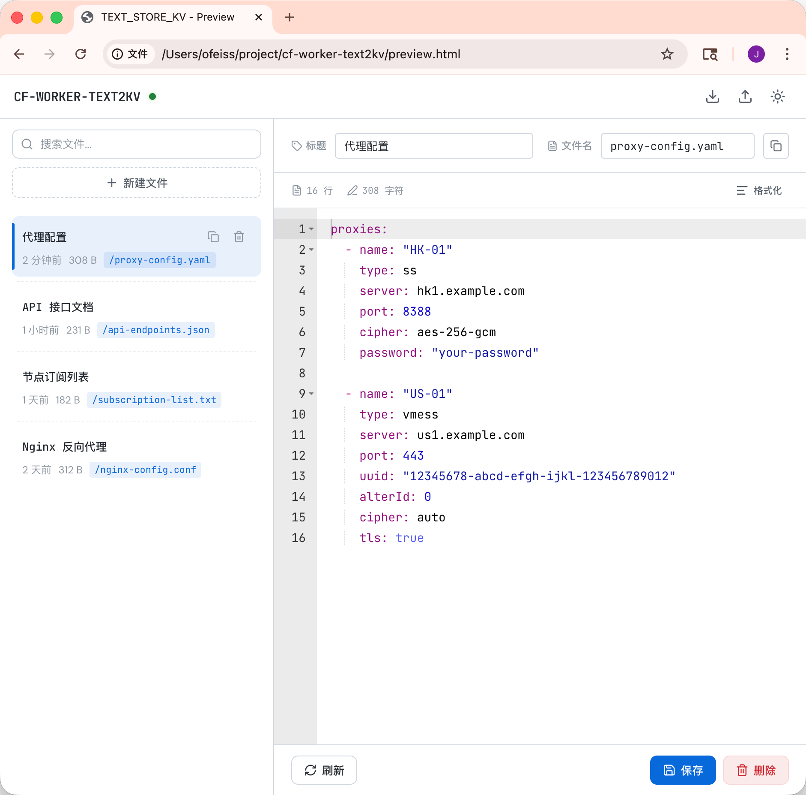
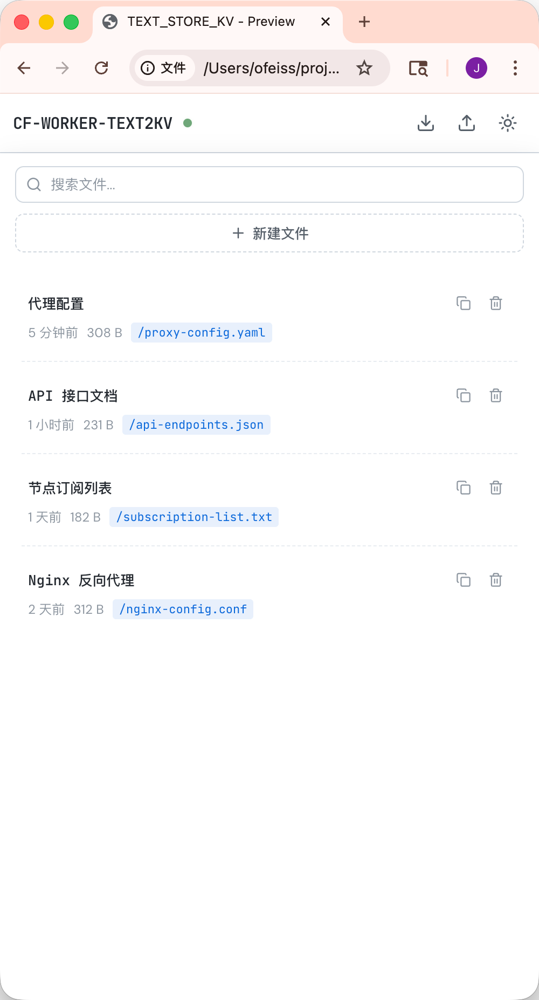
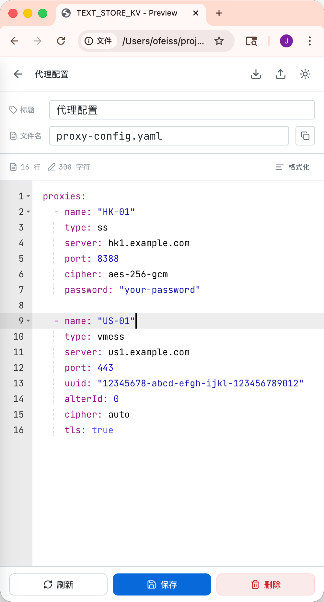

#  TEXT-STORE-HUB

[English](README.md)

一个支持多部署目标的文本文件管理与分发系统：

- **Cloudflare Workers + KV**（仓库根目录）
- **Vercel Edge + Turso**（`vercel/` 子目录）
- **Deno Deploy + Deno KV**（`deno/` 子目录）

它们各自的 UI 与 API 行为保持一致，但代码与存储相互独立。

## 截图

### 桌面端



### 移动端

<p float="left">
  
  
</p>

## 功能特性

- **Web 管理后台** — 文件增删改查，集成 [Ace Editor](https://ace.c9.io/)（语法高亮、行号、代码折叠）
- **公开文件访问** — 通过 `https://your-domain.com/f/{filename}` 分享文件，始终返回最新内容
- **响应式设计** — 桌面端双栏布局 + 移动端双视图切换
- **深色 / 浅色主题** — 持久化到 localStorage
- **JSON / YAML 格式化** — 编辑器内一键格式化
- **导入 / 导出** — JSON 批量备份和恢复（Base64 编码内容）
- **搜索** — 按标题或文件名实时过滤文件列表
- **脏状态跟踪** — 未保存更改标记，切换时弹出确认提示
- **快捷键** — `Ctrl/Cmd+S` 保存

## 技术栈

### Cloudflare 版本（根目录）

- **运行时**: Cloudflare Workers
- **存储**: Cloudflare KV
- **认证**: 自定义登录页 + SHA-256 Cookie Token

### Vercel 版本（`vercel/`）

- **运行时**: Vercel Edge Runtime
- **存储**: Turso（libSQL / SQLite）
- **认证**: 同样的自定义登录页 + SHA-256 Cookie Token

### Deno 版本（`deno/`）

- **运行时**: Deno
- **存储**: Deno KV
- **认证**: 同样的自定义登录页 + SHA-256 Cookie Token

## 部署方式

## 方案 A：Cloudflare Workers（根目录）

### 1. 前置条件

- [Node.js](https://nodejs.org/) >= 18
- [pnpm](https://pnpm.io/)（或 npm/yarn）
- [Cloudflare 账号](https://dash.cloudflare.com/)

### 2. 克隆并安装

```bash
git clone https://github.com/ofeiss/text-store-hub.git
cd text-store-hub
pnpm install
```

### 3. 创建 KV 命名空间

```bash
npx wrangler kv:namespace create TEXT_STORE_KV
```

记下返回的命名空间 ID。

### 4. 配置 Wrangler

```bash
cp wrangler.example.toml wrangler.toml
```

编辑 `wrangler.toml`，将 `YOUR_KV_NAMESPACE_ID` 替换为实际 ID。

### 5. 设置管理密码

```bash
npx wrangler secret put ADMIN_PASSWORD
```

### 6. 部署

```bash
npx wrangler deploy
```

### 7. 本地开发

在仓库根目录创建 `.dev.vars`：

```env
ADMIN_PASSWORD=你的密码
```

然后启动：

```bash
pnpm dev
```

## 方案 B：Vercel Edge + Turso（`vercel/`）

### 1. 前置条件

- [Node.js](https://nodejs.org/) >= 18
- [pnpm](https://pnpm.io/)
- [Vercel 账号](https://vercel.com/)
- [Turso 数据库](https://turso.tech/)

### 2. 安装子项目依赖

```bash
cd vercel
pnpm install
```

### 3. 配置环境变量

本地开发可先复制：

```bash
cp .env.example .env.local
```

必填变量：

- `ADMIN_PASSWORD`
- `TURSO_DATABASE_URL`
- `TURSO_AUTH_TOKEN`

### 4. 本地开发

```bash
cd vercel
pnpm dev:vercel
```

### 5. 部署

在 Vercel 导入该仓库时：

- 将 **Root Directory** 设为 `vercel`
- 配置上述 3 个环境变量
- 请绑定**自定义域名**（中国大陆 IP 通常无法稳定访问 Vercel 默认域名）

然后部署：

```bash
cd vercel
pnpm deploy:prod
```

## 方案 C：Deno Deploy（`deno/`）

### 1. 前置条件

- [Deno](https://deno.com/)
- [Deno Deploy 账号](https://dash.deno.com/)

### 2. 部署到云端

直接在 **Deno Deploy** 控制台绑定 GitHub 仓库：

1. 在控制台点击新建 Project，关联本项目仓库
2. 选择入口文件（Entry File）：`deno/main.js`
3. 填入环境变量：`ADMIN_PASSWORD`
4. 点击部署
5. **注意（重要）：** 首次部署时可能会因为缺少数据库而报错。请前往该项目的 **Settings -> KV** 页面，手动创建一个 KV 数据库并分配给该项目。分配完成后即可正常运行！

### 3. 本地开发

```bash
cd deno
deno task dev
```

## 数据与迁移

- Cloudflare 与 Vercel 部署是**相互独立**的。
- 不提供自动双向同步。
- 需要迁移时，使用应用内置 `导出 / 导入` 功能即可。

## 路由说明

| 路径 | 方法 | 功能 | 认证 |
|------|------|------|------|
| `/` | GET | 管理后台（或登录页） | 需要 |
| `/f/{filename}` | GET | 公开访问文件（纯文本） | 不需要 |
| `/api/files` | GET | 获取文件列表 | 需要 |
| `/api/files` | POST | 创建文件 | 需要 |
| `/api/files/{id}` | GET | 获取文件详情 | 需要 |
| `/api/files/{id}` | PUT | 更新文件 | 需要 |
| `/api/files/{id}` | DELETE | 删除文件 | 需要 |
| `/api/export` | GET | 导出所有数据为 JSON | 需要 |
| `/api/import` | POST | 批量导入 JSON 数据 | 需要 |
| `/api/login` | POST | 登录 | 不需要 |
| `/api/logout` | POST | 退出登录 | 不需要 |

## 许可证

MIT
